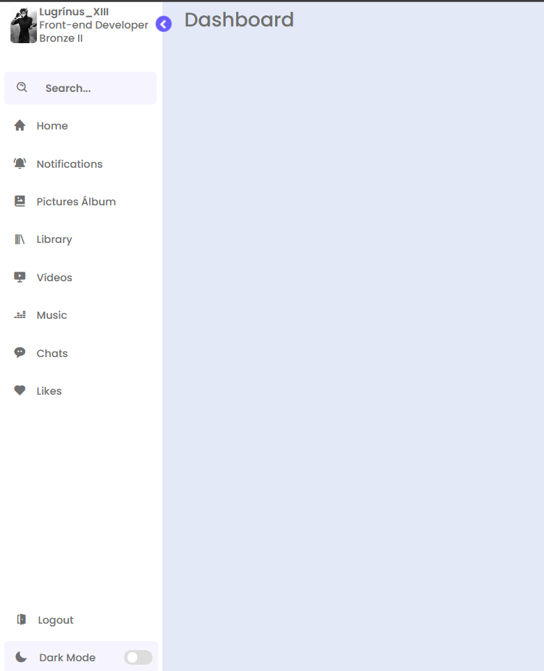

# Perfil🎻

🧠 Projeto de Front-End 3 🖥️
============================
💻 Tecnologias 🖥️
==================
Esse projeto foi desenvolvido durante algumas aulas pelo youtube
Aqui se Encontra um projeto de perfil em uma rede de comunicação (Como instagram, facebook, etc..) esse projeto utilizando Html, Css & JS (-Git & GitHub para armezanamento) e epenas uma apresentação não possuindo nenhuma função o link externo.
Apenas o botões  de o de recolher e expansão de aba e modo light e dark mode funcionam

